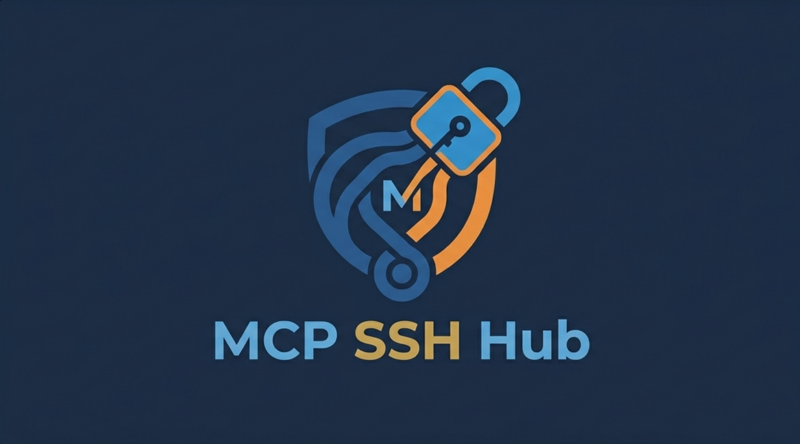

# mcpsshub


mcpsshub is an open‑source, MIT‑licensed project that provides a lightweight **Model Context Protocol** (MCP) server for remote command execution and endpoint management. It allows you to expose local services or devices over the network and control them via a simple WebSocket API.

## Features
- **Remote command execution** – Run shell commands on any machine that has the agent installed.
- **Endpoint discovery** – Automatically register servers and their capabilities with the central MCP hub.
- **Secure authentication** – Uses token‑based auth stored in cookies or as a query parameter.
- **Simple setup** – One Docker compose file, one `npm run dev` command, or a single shell script to install the agent on any host.

## Quick Start
```bash
# 1. Clone the repo and install deps
git clone https://github.com/youruser/mcpsshub.git
cd mcpsshub
pnpm i

# 2. Build and push the Docker image via GitHub Actions (see .github/workflows/docker.yml)
#    The image will be published to ghcr.io/<OWNER>/mcpsshub:latest

# 3. Deploy using Docker Compose with the image from GHCR
cat <<'EOF' > docker-compose.yml
version: '3'
services:
  mcpsshub:
    image: ghcr.io/${{ github.repository_owner }}/mcpsshub:latest
    ports:
      - "3000:3000"
    environment:
      DB_PATH: /app/data/mcpsshub.db
    volumes:
      - ./data:/app/data
EOF

docker compose up -d
```
```

### Using the Agent Script
The agent script is generated by `generateAgentScript(token, hostUrl)` and can be embedded in a Dockerfile or run directly. It:
1. Ensures Node.js and the `ws` package are installed.
2. Connects to the MCP hub via WebSocket.
3. Listens for `command_request` messages and executes them with `/bin/bash`.
4. Sends back stdout, stderr, and exit code.

## API Endpoints
- `GET /api/servers` – list registered servers.
- `POST /api/servers/[id]/rules` – add rules to a server.
- `GET /api/endpoints` – list available endpoints.

See the source for full details.

## License
MIT © 2026 The mcpsshub Authors
